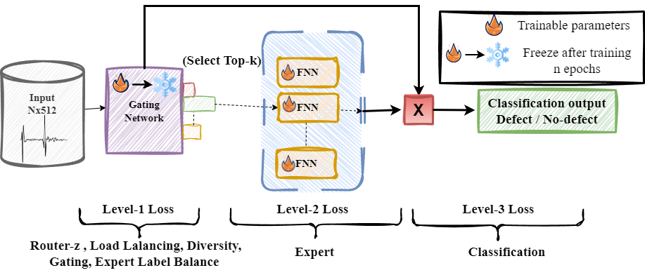

# MOMoE

Our recent work titled **Mixture-of-Experts for Multi-Domain Defect Identification in Non-Destructive Inspection** accepted in _International Conference of Machine Learning Applications, 2024_

**Abstract** Composite materials are widely used in aircraft structures because of their superior mechanical properties. However, their complex failure modes require sophisticated inspection methods to ensure structural integrity. Ultrasonic testing (UT) is a common non-destructive inspection (NDI) technique for aircraft composites that can detect internal and external defects with high resolution and accuracy. Despite their effectiveness, traditional UT methods rely on the manual interpretation of ultrasonic signals, which is time-consuming, labor-intensive, and subjective. Furthermore, processing such large-scale data, particularly across materials of varying thicknesses, significantly increases the computational demands of deep learning model optimization. To overcome these challenges, we propose an efficient sparse mixture-of-experts (MoE) model with a multi-level loss function and introduce four novel training objectives to improve computational efficiency and accuracy in identifying surface defects in composite aircraft materials. We evaluated our approach on material with multiple thicknesses or domains comprising various defects. Our experimental results demonstrate higher accuracy and F1-Score, with only 10% training epochs compared to baseline MoE.

_Code will be updated soon!_
